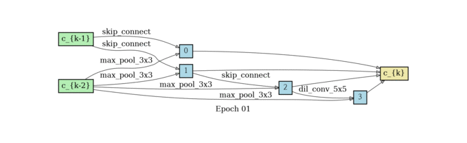
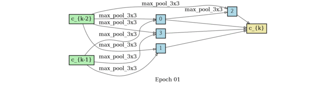
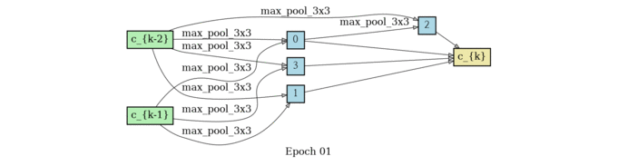
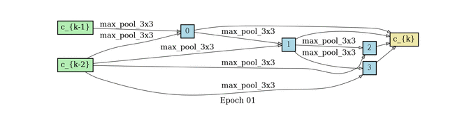
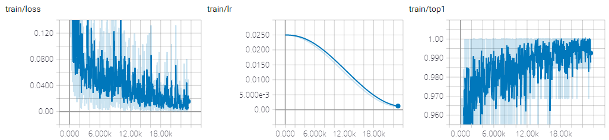
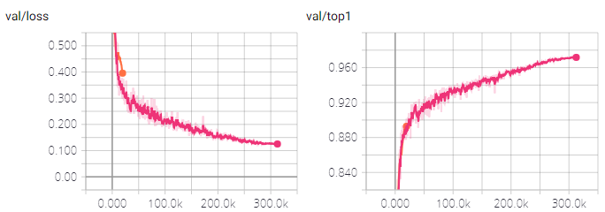
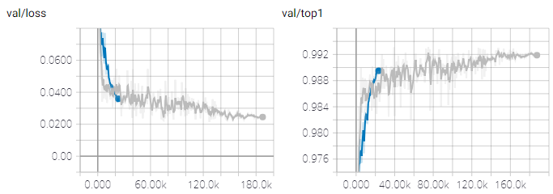

# DARTSQ: Differentiable Architecture Search + Quantization Aware Training

**what is it:** this is DARTSQ, which is based on darts and works as a whole procedure of NAS and quantization

**original darts:** Liu, Hanxiao, Karen Simonyan, and Yiming Yang. "Darts: Differentiable architecture search." arXiv preprint arXiv:1806.09055 (2018). [[arxiv](https://arxiv.org/abs/1806.09055)]

**aim:** darts+lsq;  

1. darts+朴素qat;  
2. darts+lsq;

## Details

**我怎么改darts和quantization的代码？**

1. 继承并写新的量化算子；
2. 重写model模块即search_cnn模块、search_cells以及ops；
3. 将训练的forward替换成量化训练的quantize_forward；
4. 写个FakeQuantize类来处理反向传播问题；
5. 将普通推理改成量化推理；

- problems
  - resnet模块可以直接用朴素量化吗，细节是怎样的？
    >【真的吗？我需要确认卷积->矩阵乘法的细节】  
    ><p>【感觉不需要了解清楚卷积->矩阵乘法的映射细节，见原理公式(6)，得到的是单算子输出对应位置的元素，如果将其推广到多个算子，只需要在后面加类似的矩阵乘和结构，并且每一块乘和结构单独使用自身的s1,s2,z1,z2】  
    ><p>【推广后的原理公式(6)对应darts论文图中混合边】
    ><p>【我应该确认的是，在量化训练步骤中，量化反量化后的x相加运算即论文公式(1)，会对量化误差产生什么影响(直觉上没影响);以及，在量化推理步骤中，我该如何确认每层的M，比如1->2和1->3二者的M？(把它们看成是不同的层，则使用不同的M)】
    ><p>【问题在于，量化推理步骤中，如果我将混合边得到的输出看成是一层，那多层作为输入时，能不能直接让定点x相加呢？感觉可以对单算子相加进行一次量化，再对混合算子相加进行一次量化。因为这两步的加法操作可以看成是两步加法算子：单算子作为输入，混合算子作为输出；混合算子作为输入，特征图作为输出。为什么需要这样做，因为对于同一大层来说，应该有共同的x】
    ><p>【问题在于，这样的量化效果也许对混合网络的结构不错，但对于离散后的网络量化效果不好。也许可以像陈叔所说，在最后再进行一次量化训练】
    ><p>【我为什么不在离散，即确定网络结构之后再进行量化训练？如果我这样做，那我的想法就只是一个工程了】
    ><p>？？？不这样做的理由是，网络结构和量化共同影响最终效果，即在训练阶段得到的最优解，在部署即量化后得到的不一定是最优解。真的吗
    ><p>【如果以上理由成立，那么我该如何量化混合网络结构，并在离线后继承混合网络结构的量化参数呢？】
    ><p>【我能不能在每次darts的架构迭代即确认临时结构后，直接进行离散然后量化训练并评估呢？(原darts是直接对混合结构评估)，
    >（原darts为什么不这样做呢？）这个可以当成是对蒋昂、师兄提问的回答，该提问为混合结构最优并不代表离散结构最优; 但这样会破坏原darts的连续性吗；根據奧卡姆剃鬚刀原則，應該盡量簡單，直接在混合結構上量化，看看能不能行得通。我之所以對直接量化做法有顧慮，是因爲直接量化后的[min, max]範圍變大了，可能產生roundding error，以及上述那個提問帶來的影響。似乎沒有別的問題了】
    ><p>【如果我担心[min, max]的范围变大了，只需要在离散后再进行一次量化参数的更新，就能获得更合适的量化参数了。当然这种做法依然是很粗糙的，连续和离散之间依然存在着gap，至于这个gap的影响有多大和怎么缓解这种影响，是我实现了基本的功能后才考虑的问题】
    ><p>【再次确认是否可行-即直接对混合网络进行量化，可行】

    ><p>结论：resnet模块可以直接用朴素量化，细节就是混合算子中每种算子对应有自己独立的s1,s2和z1,z2，但共用同一个s3。注意：这样我得到的是公式(2)中的临时特征图，而不是公式(1)中的特征图。
    

## Requirements

- python 3
- pytorch >= 0.4.1
- graphviz
    - First install using `apt install` and then `pip install`.
- numpy
- tensorboardX

## Command Usage
```
nohup python search.py --name cifar10 --dataset cifar10 --batch_size 32 --w_lr 0.07 --epochs 100  >/dev/null 2>&1 &
```

## Run example

Adjust the batch size if out of memory (OOM) occurs. It dependes on your gpu memory size and genotype.

- Search

```shell
python search.py --name cifar10 --dataset cifar10
```

- Augment

```shell
# genotype from search results
python augment.py --name cifar10 --dataset cifar10 --genotype "Genotype(
    normal=[[('sep_conv_3x3', 0), ('dil_conv_5x5', 1)], [('skip_connect', 0), ('dil_conv_3x3', 2)], [('sep_conv_3x3', 1), ('skip_connect', 0)], [('sep_conv_3x3', 1), ('skip_connect', 0)]],
    normal_concat=range(2, 6),
    reduce=[[('max_pool_3x3', 0), ('max_pool_3x3', 1)], [('max_pool_3x3', 0), ('skip_connect', 2)], [('skip_connect', 3), ('max_pool_3x3', 0)], [('skip_connect', 2), ('max_pool_3x3', 0)]],
    reduce_concat=range(2, 6)
)"
```

- with docker

```shell
$ docker run --runtime=nvidia -it khanrc/pytorch-darts:0.2 bash

# you can run directly also
$ docker run --runtime=nvidia -it khanrc/pytorch-darts:0.2 python search.py --name cifar10 --dataset cifar10
```

## Multi-GPU

This project suppports multi-gpu. The larger batch size and learning rate are required to take advantage of multi-gpu.

- Search

```
python search.py --name cifar10-mg --dataset cifar10 --gpus 0,1,2,3 \
    --batch_size 256 --workers 16 --print_freq 10 \
    --w_lr 0.1 --w_lr_min 0.004 --alpha_lr 0.0012
```

- Augment

```
python augment.py --name cifar10-mg --dataset cifar10 --gpus 0,1,2,3 \
    --batch_size 384 --workers 16 --print_freq 50 --lr 0.1 \
    --genotype "Genotype(
    normal=[[('sep_conv_3x3', 0), ('dil_conv_5x5', 1)], [('skip_connect', 0), ('dil_conv_3x3', 2)], [('sep_conv_3x3', 1), ('skip_connect', 0)], [('sep_conv_3x3', 1), ('skip_connect', 0)]],
    normal_concat=range(2, 6),
    reduce=[[('max_pool_3x3', 0), ('max_pool_3x3', 1)], [('max_pool_3x3', 0), ('skip_connect', 2)], [('skip_connect', 3), ('max_pool_3x3', 0)], [('skip_connect', 2), ('max_pool_3x3', 0)]],
    reduce_concat=range(2, 6)
)"
```

Simply, `--gpus all` makes to use all gpus.

### Cautions

It is well-known problem that the larger batch size causes the lower generalization.
Note that although the [linear scaling rule](https://arxiv.org/pdf/1706.02677) prevents this problem somewhat, the generalization still could be bad.

Furthermore, we do not know about the scalability of DARTS, where larger batch size could be more harmful.
So, please pay attention to the hyperparameters when using multi-gpu.

## Results

The following results were obtained using the default arguments, except for the epochs. `--epochs 300` was used in MNIST and Fashion-MNIST.

| Dataset | Final validation acc | Best validation acc |
| ------- | -------------------- | ------------------- |
| MNIST         | 99.75% | 99.81% |
| Fashion-MNIST | 99.27% | 99.39% |
| CIFAR-10       | 97.17% | 97.23% |

97.17%, final validation accuracy in CIFAR-10, is the same number as the paper.

### Found architectures

```py
# CIFAR10
Genotype(
    normal=[[('sep_conv_3x3', 0), ('dil_conv_5x5', 1)], [('skip_connect', 0), ('dil_conv_3x3', 2)], [('sep_conv_3x3', 1), ('skip_connect', 0)], [('sep_conv_3x3', 1), ('skip_connect', 0)]],
    normal_concat=range(2, 6),
    reduce=[[('max_pool_3x3', 0), ('max_pool_3x3', 1)], [('max_pool_3x3', 0), ('skip_connect', 2)], [('skip_connect', 3), ('max_pool_3x3', 0)], [('skip_connect', 2), ('max_pool_3x3', 0)]],
    reduce_concat=range(2, 6)
)

# FashionMNIST
Genotype(
    normal=[[('max_pool_3x3', 0), ('dil_conv_5x5', 1)], [('max_pool_3x3', 0), ('sep_conv_3x3', 1)], [('sep_conv_5x5', 1), ('sep_conv_3x3', 3)], [('sep_conv_5x5', 4), ('dil_conv_5x5', 3)]],
    normal_concat=range(2, 6),
    reduce=[[('sep_conv_3x3', 1), ('avg_pool_3x3', 0)], [('avg_pool_3x3', 0), ('skip_connect', 2)], [('skip_connect', 3), ('avg_pool_3x3', 0)], [('sep_conv_3x3', 2), ('skip_connect', 3)]],
    reduce_concat=range(2, 6)
)

# MNIST
Genotype(
    normal=[[('sep_conv_3x3', 0), ('dil_conv_5x5', 1)], [('sep_conv_3x3', 2), ('sep_conv_3x3', 1)], [('dil_conv_5x5', 3), ('sep_conv_3x3', 1)], [('sep_conv_5x5', 4), ('dil_conv_5x5', 3)]],
    normal_concat=range(2, 6),
    reduce=[[('dil_conv_3x3', 0), ('sep_conv_3x3', 1)], [('avg_pool_3x3', 0), ('skip_connect', 2)], [('dil_conv_5x5', 3), ('avg_pool_3x3', 0)], [('dil_conv_3x3', 1), ('max_pool_3x3', 0)]],
    reduce_concat=range(2, 6)
)
```

### Architecture progress

<p align="center">


<br/> CIFAR-10 
</p>

<p align="center">


<br/> MNIST 
</p>

<p align="center">


<br/> Fashion-MNIST 
</p>

### Plots

<p align="center">

</p>
<p align="center"> Search-training phase of Fashion-MNIST </p>

<p align="center">


</p>
<p align="center"> Augment-validation phase of CIFAR-10 and Fashion-MNIST </p>

## Reference

https://github.com/quark0/darts (official implementation)

### Main differences to reference code

- Supporting pytorch >= 0.4
- Supporting multi-gpu
- Code that is easy to read and commented.
- Implemenation of architect
    - Original implementation is very slow in pytorch >= 0.4.
- Tested on FashionMNIST / MNIST
- Tensorboard
- No RNN

and so on.
